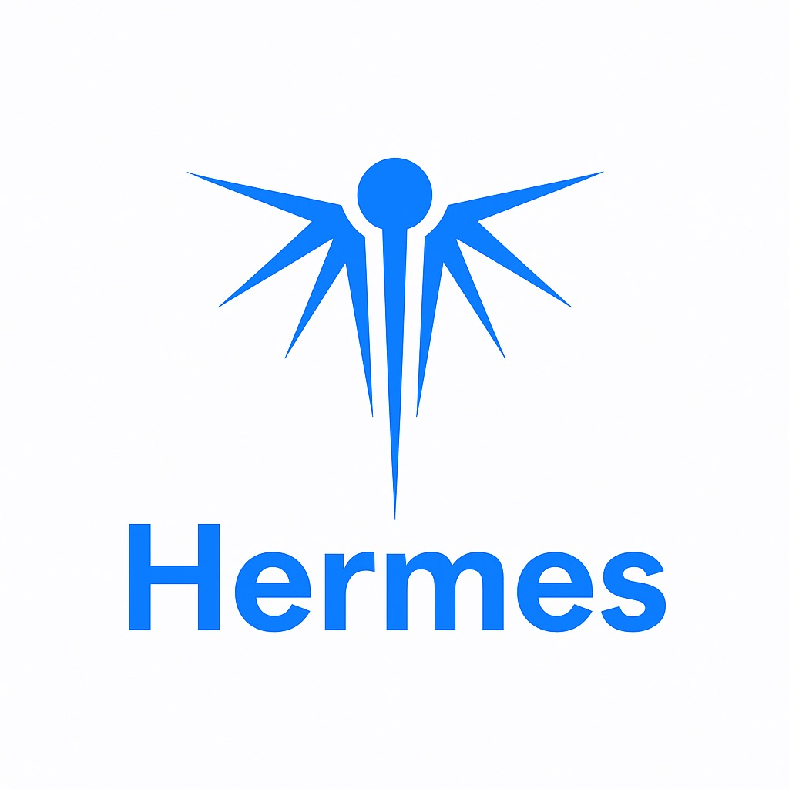

# 🏷️ Hermes 👨‍💻

> Plataforma de gestão para vendedores Amazon: conecta a loja via SP-API e Amazon Ads,
> sincroniza pedidos/financeiro, calcula margens, automatiza precificação e campanhas, e
> gere assinaturas — tudo em um monólito modular .NET com extensão Chrome.

| Visão Geral | Logo |
|-------------|------|
| **Hermes** é uma plataforma de gestão para *sellers* Amazon. Unifica conexão de loja (SP-API), publicidade (Amazon Ads), métricas financeiras, precificação automática e assinatura em um único produto. Projeto acadêmico individual de Engenharia de Software — PUC Minas. |  |

## 🚧 Status do Projeto


## 📚 Índice

1. [🔗 Links Úteis](#-links-úteis)
2. [📝 Sobre o Projeto](#-sobre-o-projeto)
3. [✨ Funcionalidades Principais](#-funcionalidades-principais)
4. [🛠 Tecnologias Utilizadas](#-tecnologias-utilizadas)
5. [🏗 Arquitetura](#-arquitetura)
6. [🔧 Instalação e Execução](#-instalação-e-execução)
7. [🚀 Deploy](#-deploy)
8. [📂 Estrutura de Pastas](#-estrutura-de-pastas)
9. [🎥 Demonstração](#-demonstração)
10. [🧪 Testes](#-testes)
11. [🔗 Documentações utilizadas](#-documentações-utilizadas)
12. [👥 Autores](#-autores)
13. [🤝 Contribuição](#-contribuição)
14. [🙏 Agradecimentos](#-agradecimentos)
15. [📄 Licença](#-licença)

## 🔗 Links Úteis

- **Demo:** Não aplicável; este repositório documenta o projeto, a arquitetura e os diagramas.
- **Documentação de Projeto:** [`docs/Documentacao-de-Projeto.md`](docs/Documentacao-de-Projeto.md)
- **Portal:** `https://portal.hermess.app`

## 📝 Sobre o Projeto

Vender na Amazon é operar em vários sistemas desconectados: o Seller Central para
pedidos e inventário, o console de Ads para publicidade, planilhas para margem e
custo, e ferramentas avulsas para pesquisa de produto. O **Hermes** unifica essa
operação. Ele conecta a conta do seller via **OAuth da SP-API** e da **Amazon Ads API**,
sincroniza automaticamente pedidos e eventos financeiros, calcula lucro real vs.
estimado, automatiza precificação e campanhas, e ainda oferece uma **extensão Chrome**
para análise de produtos diretamente nas páginas da Amazon.

O problema central que resolve: dar ao seller **visão financeira e operacional unificada
e em tempo quase real**, eliminando o trabalho manual de consolidar dados de múltiplas
APIs da Amazon.

## ✨ Funcionalidades Principais

- **Conexão de loja (SP-API):** OAuth, sincronização de pedidos, inventário, financeiro
  e listagem, com notificações via AWS SQS.
- **Gestão de Amazon Ads:** criação e gerência de campanhas, ad groups, keywords e
  targets; estratégias automáticas de bid.
- **Métricas e relatórios:** consolidação de vendas, lucro real vs. estimado, e
  relatórios de gasto/performance de Ads (jobs duráveis com polling).
- **Precificação automática (Repricing):** estratégias `MATCH_BUYBOX`,
  `BEAT_LOWEST`, `STAY_COMPETITIVE`.
- **Automação de WhatsApp (W-API):** notificações ao seller.
- **Assinatura e pagamentos:** Stripe (módulo Payments) e gateways legados
  (PagSeguro/Eduzz/Kiwify).
- **Extensão Chrome:** análise de produto, calculadora de margem, tarifas FBA/DBA,
  consulta de marca (INPI).
- **Planner (unit economics):** simulação de cenários de custo e lucro.

## 🛠 Tecnologias Utilizadas

**Front-end**
- Portal Web: Next.js 15, React 19, TypeScript, Tailwind CSS, shadcn/ui, Radix UI,
  React Hook Form, TanStack Table, Recharts, SignalR, PostHog e Vitest.
- Extensão Chrome: monorepo pnpm/Turbo com React 19, TypeScript, Vite 6, Tailwind CSS,
  Radix UI, Zustand, TanStack Query, Recharts, Vitest e pacotes `chrome-extension`,
  `pages/side-panel`, `pages/product-page-charts` e `pages/search-product-cards`.
- Gerenciador de pacotes: pnpm.

**Back-end**
- .NET 9 / ASP.NET Core Web API
- MediatR 13 (CQRS), FluentValidation 11
- Entity Framework Core 9 (SQL Server)
- ASP.NET Core Identity + JWT
- SignalR (atualizações em tempo real de produtos)
- Serilog (+ Seq), OpenTelemetry + Prometheus, Swashbuckle/Swagger

**Infra & DevOps**
- SQL Server (multi-tenant banco-por-loja)
- Redis (cache)
- RabbitMQ (mensageria Products/Keepa)
- Docker / Docker Swarm

**Integrações**
- Amazon SP-API, Amazon Ads API, AWS SQS/EventBridge
- Stripe, PagSeguro/PagBank, Eduzz, Kiwify
- Keepa, Melhor Envio, Infosimples/INPI
- Azure Blob / AI Vision / Document Intelligence, Brevo, W-API, Google OAuth

## 🏗 Arquitetura

O Hermes é um **Monólito Modular** com **Clean Architecture** por módulo, **CQRS**
(MediatR) e padrão **Outbox** para eventos de integração. São nove módulos
(`Usuarios`, `Payments`, `GatewayPay`, `Stores`, `Products`, `ExtensaoAPI`, `Planner`,
`Keepa`, `OutBox`) com bancos separados, mais uma estratégia **multi-tenant
banco-por-loja** para os dados operacionais de cada vendedor. No front-end do Portal,
o Next.js também atua como **BFF (Backend for Frontend)**: a interface chama rotas
`/api/*` do próprio Portal, que validam a sessão, anexam o token no servidor e
repassam a chamada para a API Host, evitando expor a URL interna e regras de
integração diretamente no navegador.

**Exemplos de diagramas** (fontes em PlantUML em [`docs/diagramas/`](docs/diagramas) e imagens em [`docs/imagens/`](docs/imagens)):

| Diagrama | Tipo | Imagem | Fonte |
|----------|------|--------|-------|
| Contexto do sistema | C4 — Nível 1 | [`c4-contexto.png`](docs/imagens/c4-contexto.png) | [`c4-contexto.puml`](docs/diagramas/c4-contexto.puml) |
| Container | C4 — Nível 2 | [`c4-container.png`](docs/imagens/c4-container.png) | [`c4-container.puml`](docs/diagramas/c4-container.puml) |
| Componentes | UML Componentes | [`componentes.png`](docs/imagens/componentes.png) | [`componentes.puml`](docs/diagramas/componentes.puml) |
| Implantação (Docker Swarm) | UML Deployment | [`implantacao.png`](docs/imagens/implantacao.png) | [`implantacao.puml`](docs/diagramas/implantacao.puml) |

> Casos de uso, classes, sequência, comunicação, estados e ER estão na [documentação completa](docs/Documentacao-de-Projeto.md), com fontes em `docs/diagramas/` e imagens em `docs/imagens/`.

## 🔧 Instalação e Execução

### Pré-requisitos
- [.NET SDK 9](https://dotnet.microsoft.com/)
- [Node.js 22.12+](https://nodejs.org/) (Portal e Extension)
- [pnpm 9.15+](https://pnpm.io/) (gerenciador usado pelos frontends)
- [Docker](https://www.docker.com/) e Docker Compose
- Acesso a uma instância de **SQL Server**, **Redis** e **RabbitMQ**

### Variáveis de ambiente

> ⚠️ **Nunca** versione segredos. Use variáveis de ambiente / secret manager.

```bash
# Conexões (uma por módulo)
ConnectionStrings__StoresCentral="Server=...;Database=StoresCentral;..."
ConnectionStrings__Usuarios="Server=...;Database=Usuarios;..."
ConnectionStrings__Produtos="Server=...;Database=Produtos;..."
ConnectionStrings__OutBox="Server=...;Database=OutBox;..."

# Infra
Redis__ConnectionString="redis:6379"
RabbitMQ__Host="rabbitmq"

# Integrações externas
Amazon__ClientId="***"
AmazonAds__ClientId="***"
Stripe__SecretKey="***"
Keepa__ApiKey="***"
Jwt__Secret="***"
```

### Dependências e execução (backend)

```bash
dotnet restore
dotnet build
dotnet run --project Host
# Swagger: https://localhost:8081/swagger
```

### Frontend

```bash
# Portal Web (Next.js)
cd Portal
pnpm install --frozen-lockfile
pnpm dev

# Extensão Chrome (pnpm workspace + Turbo + Vite)
cd Extension
pnpm install --frozen-lockfile
pnpm dev
```

### docker-compose

```bash
docker compose up -d --build
# API:   http://localhost:8080
# Redis: localhost:6379
```

## 🚀 Deploy

Implantação em **Docker Swarm**, com serviços para a API (`hosts`), o worker de Outbox
(`hosts_outbox_workeprocess`), o worker do Keepa, `redis` e `rabbitmq`. Os bancos SQL
Server são externos ao cluster.

```bash
docker stack deploy -c docker-compose.yml hermes
```

## 📂 Estrutura de Pastas

```
.
├── Host/                         # API (controllers, Program.cs, configs/DI)
├── Modules/                      # Monólito modular (Clean Architecture por módulo)
│   ├── Usuarios/                 #   identidade, JWT, planos, assinaturas legadas
│   ├── Payments/                 #   pagamentos Stripe (billing accounts, trial)
│   ├── GatewayPay/               #   gateways legados (PagSeguro/Eduzz/Kiwify)
│   ├── Stores/                   #   SP-API + Amazon Ads, pedidos, financeiro (CENTRAL)
│   ├── Products/                 #   catálogo, favoritos, fornecedores
│   ├── ExtensaoAPI/              #   extensão Chrome: calculadora, tarifas, INPI
│   ├── Planner/                  #   unit economics
│   ├── Keepa/                    #   integração Keepa (workers)
│   └── OutBox/                   #   Outbox + worker dedicado
├── Shareds/                      # transversais: Domain, Contracts, Infrastructure, SDKs
├── Portal/                       # frontend web Next.js 15 + React 19 + pnpm
├── Extension/                    # extensão Chrome: pnpm workspace + Turbo + Vite
├── docs/
│   ├── Documentacao-de-Projeto.md
│   ├── diagramas/                # fontes .puml (C4, casos de uso, sequência, estados, ER...)
│   └── imagens/                  # imagens .png geradas a partir dos diagramas PlantUML
└── docker-compose.yml
```

> Cada módulo segue a separação `Domain` → `Application` → `Contracts` → `Infrastructure`.

## 🎥 Demonstração

| Artefato | Preview |
|----------|---------|
| Diagramas PlantUML renderizados | [`docs/imagens/`](docs/imagens) |
| Documentação completa do projeto | [`docs/Documentacao-de-Projeto.md`](docs/Documentacao-de-Projeto.md) |
| Fontes dos diagramas | [`docs/diagramas/`](docs/diagramas) |

## 🧪 Testes

Cada módulo possui um projeto de testes (`*.Tests` / `*.Testes`).

```bash
dotnet test
```

## 🔗 Documentações utilizadas

- [Amazon Selling Partner API (SP-API)](https://developer-docs.amazon.com/sp-api/)
- [Amazon Ads API](https://advertising.amazon.com/API/docs/)
- [.NET / ASP.NET Core](https://learn.microsoft.com/aspnet/core/)
- [MediatR](https://github.com/jbogard/MediatR)
- [Entity Framework Core](https://learn.microsoft.com/ef/core/)
- [PlantUML](https://plantuml.com/)

## 👥 Autores

| Nome | Foto | GitHub | LinkedIn | Gmail |
|------|------|--------|----------|-------|
| Arthur Miranda Sales |  | [MirandaSls](https://github.com/MirandaSls) | [mdzv](https://www.linkedin.com/in/mdzv/) | `arthursaleszv@gmail.com` |

## 🤝 Contribuição

1. Faça um *fork* do projeto.
2. Crie uma branch: `git checkout -b feat/minha-feature`.
3. Commits seguindo **[Conventional Commits](https://www.conventionalcommits.org/)**.
4. Abra um *Pull Request* para a branch `dev`.

## 🙏 Agradecimentos

Engenharia de Software — PUC Minas. Agradecimento especial ao Prof. Dr. João Paulo Aramuni.

## 📄 Licença

Distribuído sob a licença **MIT**.

## Observação

Este repositório foi criado exclusivamente para fins acadêmicos, contendo a documentação,
os diagramas e a arquitetura do projeto. O repositório original da aplicação não foi
utilizado porque o Hermes é um sistema atualmente em operação; torná-lo público poderia
expor código-fonte, regras internas de negócio, integrações e detalhes sensíveis de
segurança.
