# Documentação de Projeto para o Sistema Hermes

**Versão:** 1.0
**Autor:** Arthur Miranda Sales
**Data:** 08/06/2026

---

## Tabela de Conteúdo

1. [Introdução](#1-introdução)
2. [Modelos de Usuário e Requisitos](#2-modelos-de-usuário-e-requisitos)
   - [2.1 Descrição de Atores](#21-descrição-de-atores)
   - [2.2 Modelo de Casos de Uso](#22-modelo-de-casos-de-uso)
   - [2.3 Diagrama de Sequência do Sistema (SSD) e Contratos de Operação](#23-diagrama-de-sequência-do-sistema-ssd-e-contratos-de-operação)
3. [Modelos de Projeto](#3-modelos-de-projeto)
   - [3.1 Arquitetura](#31-arquitetura)
   - [3.2 Diagrama de Componentes e Implantação](#32-diagrama-de-componentes-e-implantação)
   - [3.3 Diagrama de Classes](#33-diagrama-de-classes)
   - [3.4 Diagramas de Sequência](#34-diagramas-de-sequência)
   - [3.5 Diagramas de Comunicação](#35-diagramas-de-comunicação)
   - [3.6 Diagramas de Estados](#36-diagramas-de-estados)
4. [Modelos de Dados](#4-modelos-de-dados)

---

## Histórico de Revisões

| Nome | Data | Razões para Mudança | Versão |
|------|------|---------------------|--------|
| Arthur Miranda Sales | 08/06/2026 | Criação do documento a partir da análise factual do projeto Hermes | 1.0 |

---

## 1. Introdução

Este documento descreve o projeto do **Sistema Hermes**, uma plataforma de gestão
para vendedores (*sellers*) que operam na Amazon. Seu propósito é registrar, de forma
acadêmico-profissional, os modelos de requisitos e de projeto que sustentam a
implementação: atores, casos de uso, arquitetura, classes de domínio, fluxos de
sequência/comunicação, máquinas de estado e o modelo de dados relacional.

O domínio do Hermes é a **operação de venda na Amazon**. O sistema conecta-se às APIs
oficiais da Amazon (**SP-API** para pedidos, inventário, financeiro e listagem; e
**Amazon Ads API** para publicidade), sincroniza dados da loja, calcula métricas e
margens, automatiza precificação e campanhas de anúncios, gere assinaturas/pagamentos
e oferece uma extensão para o navegador Chrome voltada à análise de produtos.

Tecnicamente, o Hermes é um **Monólito Modular** em **.NET 9 / ASP.NET Core**,
organizado em nove módulos com **Clean Architecture** por módulo, **CQRS** via
**MediatR** e padrão **Outbox** para eventos de integração. A persistência usa **SQL
Server** com **EF Core 9**, incluindo estratégia **multi-tenant banco-por-loja**. As
seções seguintes detalham cada modelo.

> **Nota de fidelidade ao projeto:** onde versões preliminares da documentação divergiam
> da arquitetura adotada, prevaleceram as decisões do projeto: a mensageria WhatsApp é a
> **W-API** e o SGBD é **SQL Server**.

---

## 2. Modelos de Usuário e Requisitos

### 2.1 Descrição de Atores

**Atores humanos**

| Ator | Descrição |
|------|-----------|
| **Vendedor Amazon** | Usuário principal, autenticado via JWT e com a role `assinante`. Conecta lojas, cria/gerencia campanhas de Ads, consulta métricas, configura precificação, reviews e tributação. O acesso a features é controlado por *claims* de plano (`PolicyExtension`, `PolicyMining`, `PolicyAnalytics`). |
| **Administrador de Conta** | Membro de uma *billing account* com papel `Owner`, `Admin` ou `Member` (enum `BillingAccountMemberRole`). Administra assinaturas, planos e cobrança da conta de faturamento. |

**Atores externos (sistemas integrados)**

| Ator externo | Papel no sistema |
|--------------|------------------|
| **Amazon SP-API** | OAuth de conexão da loja; pedidos, inventário, financeiro, listagem, notificações. |
| **Amazon Ads API** | OAuth de Ads; campanhas, ad groups, keywords, targets, relatórios. |
| **AWS SQS / EventBridge** | Entrega assíncrona das notificações da SP-API. |
| **Stripe** | Pagamentos e assinaturas (módulo Payments), via webhooks idempotentes. |
| **PagSeguro / Eduzz / Kiwify** | Gateways de pagamento legados (módulo GatewayPay). |
| **Keepa** | Histórico e preços de mercado de produtos. |
| **Melhor Envio** | Cálculo de frete. |
| **Infosimples / INPI** | Consulta de marca/*trademark*. |
| **Azure Blob / AI Vision / Document Intelligence** | Auditoria de pedidos e processamento de catálogos de fornecedor. |
| **Brevo** | E-mails transacionais. |
| **W-API (WhatsApp)** | Notificações por WhatsApp. |
| **n8n** | Webhook de notificações de suporte. |
| **Google OAuth** | Login externo. |
| **Redis** | Cache de extensão/produtos/mineração. |

### 2.2 Modelo de Casos de Uso

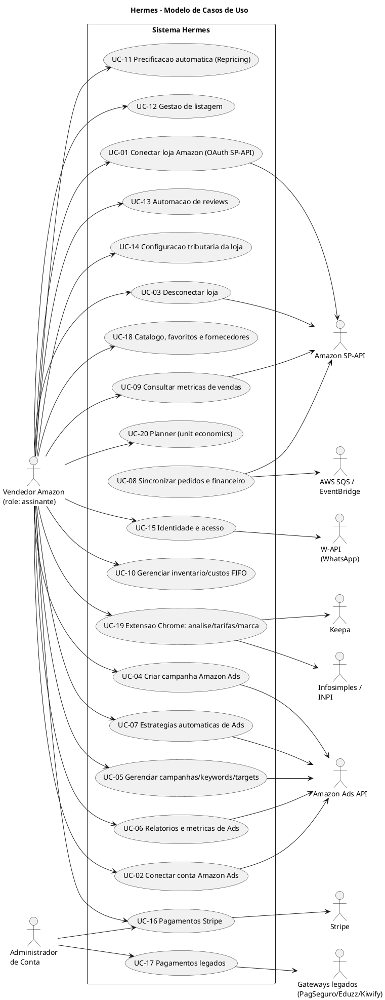

**Tabela de casos de uso**

| ID | Caso de uso | Ator(es) principal(is) |
|----|-------------|------------------------|
| UC-01 | Conectar loja Amazon (OAuth SP-API) | Vendedor, Amazon SP-API |
| UC-02 | Conectar conta Amazon Ads | Vendedor, Amazon Ads API |
| UC-03 | Desconectar loja | Vendedor, Amazon SP-API |
| UC-04 | Criar campanha Amazon Ads (Sponsored Products) | Vendedor, Amazon Ads API |
| UC-05 | Gerenciar campanhas/ad groups/targets/keywords | Vendedor, Amazon Ads API |
| UC-06 | Relatórios e métricas Amazon Ads | Vendedor, Amazon Ads API |
| UC-07 | Estratégias automáticas de Ads | Vendedor, Amazon Ads API |
| UC-08 | Sincronização de pedidos e financeiro | Amazon SP-API, AWS SQS |
| UC-09 | Consultar métricas/consolidações de vendas | Vendedor |
| UC-10 | Gerenciar inventário/custos (FIFO) | Vendedor |
| UC-11 | Precificação automática (Repricing) | Vendedor |
| UC-12 | Gestão de listagem (Listings Items API) | Vendedor, Amazon SP-API |
| UC-13 | Automação de reviews | Vendedor, Amazon SP-API |
| UC-14 | Configuração tributária da loja | Vendedor |
| UC-15 | Identidade e acesso | Vendedor, Google OAuth |
| UC-16 | Pagamentos Stripe | Vendedor, Administrador, Stripe |
| UC-17 | Pagamentos legados | Administrador, PagSeguro/Eduzz/Kiwify |
| UC-18 | Catálogo, favoritos e fornecedores | Vendedor |
| UC-19 | Extensão Chrome: análise/tarifas/marca | Vendedor, Keepa, INPI |
| UC-20 | Planner (unit economics) | Vendedor |

### 2.3 Diagrama de Sequência do Sistema (SSD) e Contratos de Operação

#### SSD — UC-01 (Conectar loja Amazon)

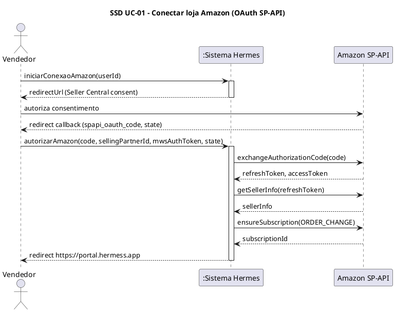

#### SSD — UC-02 (Conectar conta Amazon Ads)

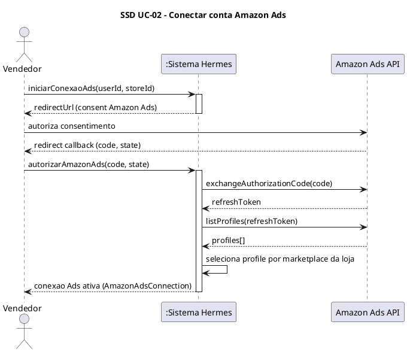

#### SSD — UC-03 (Desconectar loja)

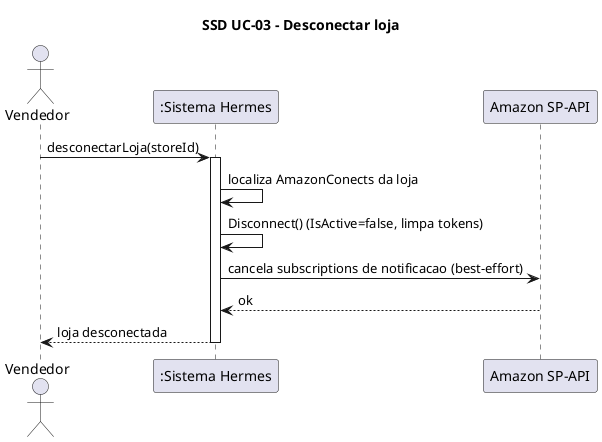

#### Contrato de Operação — UC-01

| Contrato | |
|----------|-|
| **Operação** | `Task<string> autorizarAmazon(string code, string sellingPartnerId, string mwsAuthToken, string state)` |
| **Referências cruzadas** | UC-01 (alimenta UC-08 e UC-09) |
| **Pré-condições** | Usuário autenticado; `userId` codificado no `state` (Base64Url) gerado em `InitiateAmazon`; a Amazon retornou `spapi_oauth_code` e `state` válidos; limite `StoreConnection:MaxStoresPerUser` respeitado. |
| **Pós-condições** | Código trocado por tokens (`ExchangeAuthorizationCodeAsync`); `AmazonConects` criado/atualizado (upsert) com refresh/access token → `connectId`; `Stores` criada/recuperada vinculada a `userId` e `connectId`; subscription de notificações `ORDER_CHANGE` registrada na SP-API (best-effort); retorna URL de redirect `https://portal.hermess.app`. |

#### Contrato de Operação — UC-02

| Contrato | |
|----------|-|
| **Operação** | `Task<Result> autorizarAmazonAds(string code, string state)` |
| **Referências cruzadas** | UC-02 (pré-requisito de UC-04, UC-05, UC-06, UC-07) |
| **Pré-condições** | Usuário autenticado; loja (`storeId`) existente e conectada via UC-01; a Amazon Ads retornou `code` e `state` válidos. |
| **Pós-condições** | Código trocado por `refreshToken`; *profiles* listados; *profile* selecionado pelo marketplace da loja; `AmazonAdsConnection` criada/atualizada (upsert) com `ProfileId`, `CountryCode`, `CurrencyCode` e `IsActive = true`. |

#### Contrato de Operação — UC-03

| Contrato | |
|----------|-|
| **Operação** | `Task desconectarLoja(Guid storeId)` |
| **Referências cruzadas** | UC-03 (reverte UC-01) |
| **Pré-condições** | Usuário autenticado e dono da loja; existe `AmazonConects` ativo vinculado à `storeId`. |
| **Pós-condições** | `AmazonConects.Disconnect()` aplicado (`IsActive = false`, tokens limpos); subscriptions de notificação canceladas na SP-API (best-effort); estado persistido no banco central. |

---

## 3. Modelos de Projeto

### 3.1 Arquitetura

O Hermes adota **Monólito Modular + Clean Architecture + CQRS + Outbox**.

- **Monólito Modular:** solução única (`Amazon.sln`) com nove módulos isolados em
  `Modules/` e código transversal em `Shareds/`. O *deploy* é simples (uma API), mas a
  fronteira entre *bounded contexts* é explícita — cada módulo tem seus projetos e seu
  banco. Justifica-se pela equipe enxuta e pela necessidade de evoluir contextos
  (Stores, Payments, Products) de forma independente sem o custo operacional de
  microsserviços.
- **Clean Architecture por módulo:** cada módulo separa `Domain` (entidades, enums,
  interfaces de serviço), `Application` (Commands/Queries + Handlers), `Contracts`
  (DTOs) e `Infrastructure` (DbContexts, serviços concretos, workers). As dependências
  apontam para dentro (Infrastructure → Application → Domain), protegendo as regras de
  negócio de detalhes de infraestrutura.
- **CQRS com MediatR:** controllers apenas traduzem HTTP em Commands/Queries e
  despacham via `_mediator.Send(...)`. Comandos e consultas seguem caminhos distintos,
  com `ValidationBehavior<,>` (FluentValidation) interceptando o *pipeline*. Isso isola
  intenção de escrita e leitura — essencial num domínio com leituras analíticas pesadas
  (métricas de vendas/Ads) e escritas transacionais (sincronização de pedidos).
- **Outbox Pattern:** eventos de integração são persistidos em `out.OutBoxMessages`
  (`IEventBus` → `InMemoryEventBus`) na mesma transação do dado, e republicados de forma
  assíncrona pelo `OutBoxWorker` via `IMediator.Publish`. Garante entrega confiável de
  eventos (atomicidade dado+evento) sem acoplar os módulos a um broker síncrono.

#### C4 — Nível 1 (Contexto)

```plantuml
@startuml c4-contexto
!include https://raw.githubusercontent.com/plantuml-stdlib/C4-PlantUML/master/C4_Context.puml
title C4 Nivel 1 - Diagrama de Contexto do Sistema Hermes

Person(seller, "Vendedor Amazon", "Seller assinante que gere Ads, vendas e operacao da loja")
Person(admin, "Administrador de Conta", "Gere billing account e assinaturas")

System(hermes, "Hermes", "Plataforma de gestao para sellers Amazon: Ads, metricas, sincronizacao SP-API, assinatura e automacao")

System_Ext(spapi, "Amazon SP-API", "Pedidos, inventario, financeiro, listing, notificacoes")
System_Ext(ads, "Amazon Ads API", "Campanhas, keywords, relatorios de publicidade")
System_Ext(sqs, "AWS SQS / EventBridge", "Notificacoes assincronas da Amazon")
System_Ext(stripe, "Stripe", "Pagamentos e assinaturas")
System_Ext(legacy, "PagSeguro / Eduzz / Kiwify", "Gateways de pagamento legados")
System_Ext(keepa, "Keepa", "Historico e precos de mercado")
System_Ext(melhorenvio, "Melhor Envio", "Calculo de frete")
System_Ext(inpi, "Infosimples / INPI", "Consulta de marca/trademark")
System_Ext(azure, "Azure AI", "Vision / Document Intelligence")
System_Ext(brevo, "Brevo", "Envio de e-mail")
System_Ext(wapi, "W-API", "Notificacoes WhatsApp")

Rel(seller, hermes, "Usa", "HTTPS / Extensao Chrome")
Rel(admin, hermes, "Administra", "HTTPS")
Rel(hermes, spapi, "OAuth, le pedidos/financeiro, assina notificacoes")
Rel(hermes, ads, "OAuth, cria campanhas, baixa relatorios")
Rel(sqs, hermes, "Entrega notificacoes SP-API")
Rel(hermes, stripe, "Cria assinaturas; recebe webhooks")
Rel(hermes, legacy, "Recebe webhooks de assinatura")
Rel(hermes, keepa, "Consulta historico de produtos")
Rel(hermes, melhorenvio, "Calcula frete")
Rel(hermes, inpi, "Consulta marca")
Rel(hermes, azure, "Processa catalogos de fornecedor")
Rel(hermes, brevo, "Envia e-mails transacionais")
Rel(hermes, wapi, "Envia notificacoes WhatsApp")
@enduml
```

#### C4 — Nível 2 (Container)

```plantuml
@startuml c4-container
!include https://raw.githubusercontent.com/plantuml-stdlib/C4-PlantUML/master/C4_Container.puml
title C4 Nivel 2 - Diagrama de Container do Sistema Hermes

Person(seller, "Vendedor Amazon", "Seller assinante")

System_Boundary(hermes, "Hermes") {
  Container(spa, "Portal Web", "Next.js 15 + React 19 + TypeScript + pnpm", "Portal do seller: dashboards de Ads, conexao de loja, assinatura")
  Container(ext, "Extensao Chrome", "React 19 + TypeScript + Vite 6 + pnpm/Turbo", "Side panel, graficos na pagina de produto, cards de busca, calculadora e tarifas")
  Container(api, "API Host", "ASP.NET Core 9 (Monolito Modular)", "Controllers + MediatR (CQRS) + 9 modulos + workers internos")
  Container(outbox, "Worker Outbox", ".NET Worker", "Processa out.OutBoxMessages e republica eventos")
  Container(keepaw, "Keepa WorkeProcess", ".NET Worker", "CategorieWorker / SellersWorker")
  ContainerDb(sqlcentral, "SQL Server - Central/Modulos", "SQL Server", "StoresCentral, Usuarios, Produtos, Extensao, Planners, OutBox")
  ContainerDb(sqltenant, "SQL Server - Tenant por loja", "SQL Server", "Banco-por-loja (orders, products, financeiro, Ads facts)")
  ContainerDb(redis, "Redis", "Redis", "Cache de extensao/produtos/mineracao")
  ContainerQueue(rabbit, "RabbitMQ", "RabbitMQ", "Mensageria Products/Keepa")
}

System_Ext(spapi, "Amazon SP-API", "")
System_Ext(ads, "Amazon Ads API", "")
System_Ext(sqs, "AWS SQS", "")
System_Ext(stripe, "Stripe", "")

Rel(seller, spa, "Usa", "HTTPS")
Rel(seller, ext, "Usa", "HTTPS")
Rel(spa, api, "Chama", "JSON/HTTPS")
Rel(ext, api, "Chama", "JSON/HTTPS")
Rel(api, sqlcentral, "Le/escreve", "EF Core")
Rel(api, sqltenant, "Le/escreve por tenant", "EF Core")
Rel(api, redis, "Cacheia", "")
Rel(api, rabbit, "Publica/consome", "AMQP")
Rel(api, outbox, "Persiste eventos", "out.OutBoxMessages")
Rel(outbox, sqlcentral, "Le eventos", "EF Core")
Rel(api, spapi, "OAuth/REST")
Rel(api, ads, "OAuth/REST")
Rel(sqs, api, "Notificacoes")
Rel(api, stripe, "REST + webhooks")
Rel(keepaw, rabbit, "Publica", "AMQP")
@enduml
```

### 3.2 Diagrama de Componentes e Implantação

#### Componentes (módulos + infraestrutura)

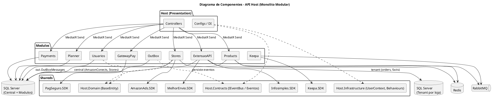

#### Implantação (Docker / Swarm)

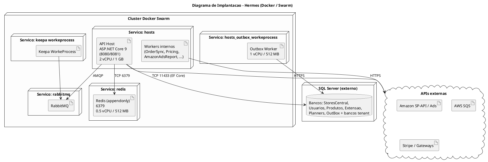

### 3.3 Diagrama de Classes

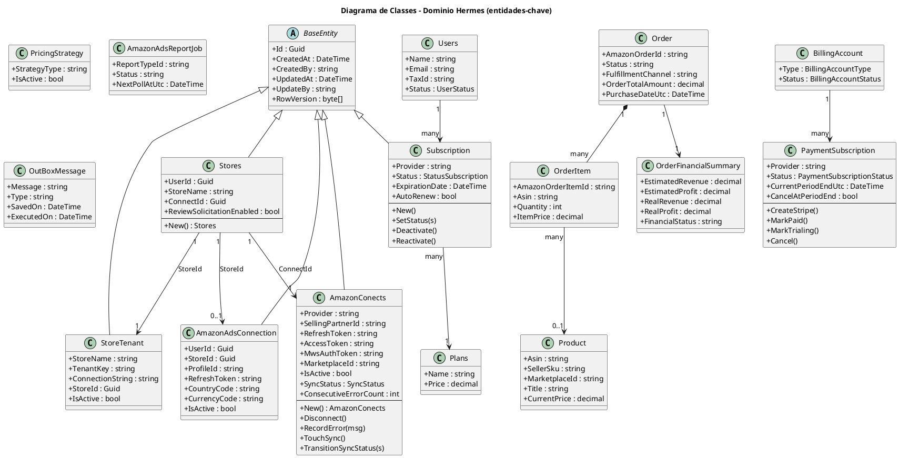

### 3.4 Diagramas de Sequência

#### Sequência de projeto — UC-01

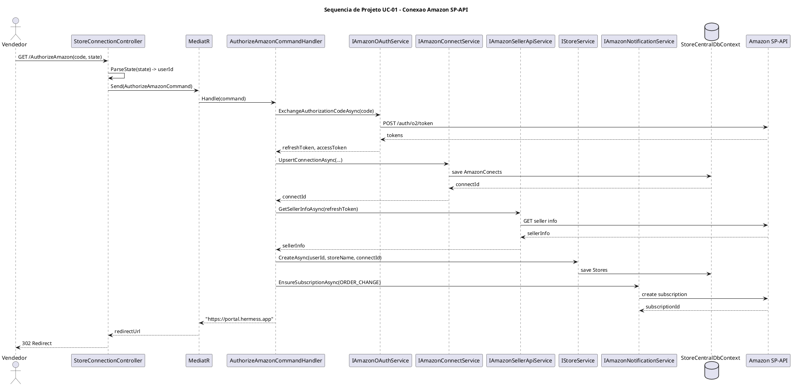

#### Sequência de projeto — UC-02

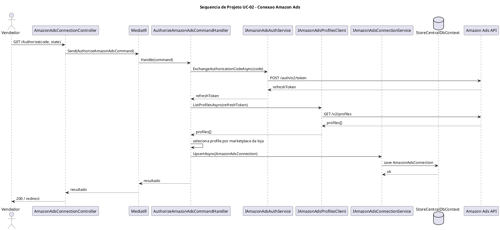

#### Sequência de projeto — UC-03

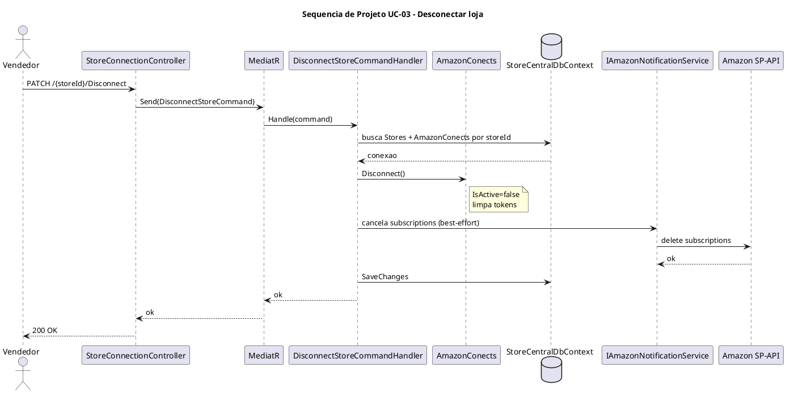

### 3.5 Diagramas de Comunicação

#### Comunicação — UC-01

```plantuml
@startuml comunicacao-uc01
title Diagrama de Comunicacao UC-01 - Conexao Amazon SP-API
left to right direction

actor Vendedor as V
object "StoreConnectionController" as CTRL
object "AuthorizeAmazonCommandHandler" as H
object "IAmazonOAuthService" as OAUTH
object "IAmazonConnectService" as CONN
object "IAmazonSellerApiService" as SELLER
object "IStoreService" as STORE
object "IAmazonNotificationService" as NOTIF
database "StoreCentralDbContext" as DB

V --> CTRL : 1: AuthorizeAmazon(code, state)
CTRL --> H : 2: Send(AuthorizeAmazonCommand)
H --> OAUTH : 3: ExchangeAuthorizationCode(code)
H --> CONN : 4: UpsertConnection() -> connectId
CONN --> DB : 4.1: save AmazonConects
H --> SELLER : 5: GetSellerInfo(refreshToken)
H --> STORE : 6: CreateAsync(userId, connectId)
STORE --> DB : 6.1: save Stores
H --> NOTIF : 7: EnsureSubscription(ORDER_CHANGE)
H --> CTRL : 8: redirectUrl
CTRL --> V : 9: 302 Redirect
@enduml
```

### 3.6 Diagramas de Estados

#### Estado — Campanha Amazon Ads

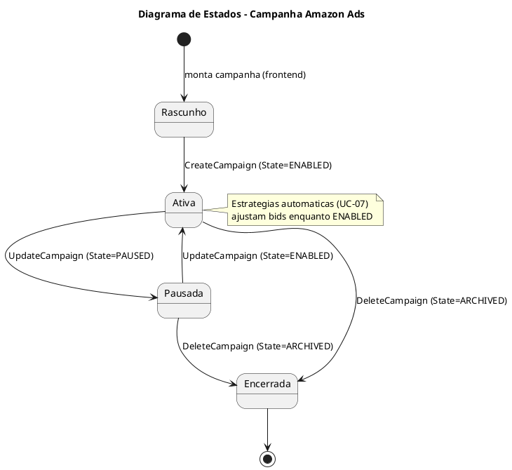

#### Estado — Conexão de Loja

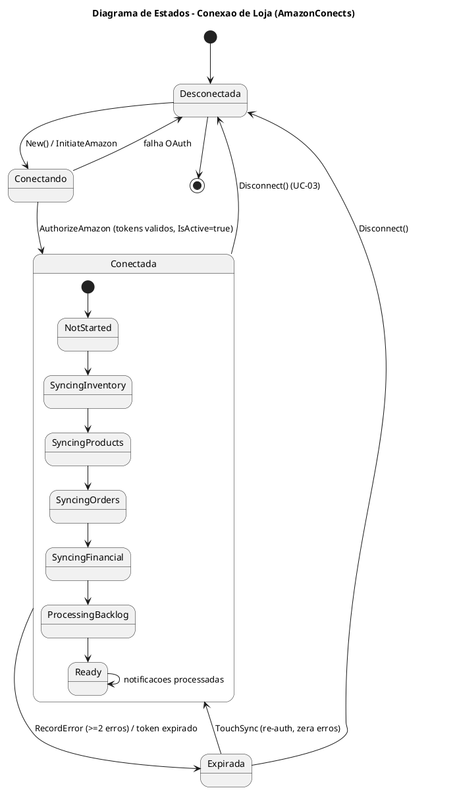

> A submáquina interna de `Conectada` reflete o enum `SyncStatus`
> (`NotStarted → SyncingInventory → SyncingProducts → SyncingOrders → SyncingFinancial
> → ProcessingBacklog → Ready`). Notificações só são processadas quando `SyncStatus == Ready`.

---

## 4. Modelos de Dados

### Diagrama Entidade-Relacionamento

```plantuml
@startuml modelo-dados-er
title Modelo de Dados (ER) - Hermes
hide circle
skinparam linetype ortho

' ===== Banco central (StoresCentral) =====
entity "AmazonConects" as conects {
  *Id : uniqueidentifier <<PK>>
  --
  SellingPartnerId : nvarchar
  MarketplaceId : nvarchar
  RefreshToken : nvarchar(2048)
  AccessToken : nvarchar(2048)
  IsActive : bit
  SyncStatus : int
  ConsecutiveErrorCount : int
  ' UNIQUE (SellingPartnerId, MarketplaceId)
}

entity "Stores" as stores {
  *Id : uniqueidentifier <<PK>>
  --
  UserId : uniqueidentifier
  StoreName : nvarchar
  ConnectId : uniqueidentifier <<FK>>
  ReviewSolicitationEnabled : bit
}

entity "AmazonAdsConnections" as adsconn {
  *Id : uniqueidentifier <<PK>>
  --
  UserId : uniqueidentifier
  StoreId : uniqueidentifier <<FK>>
  ProfileId : nvarchar
  ' UNIQUE (UserId, ProfileId)
}

entity "StoreTenants" as tenant {
  *Id : uniqueidentifier <<PK>>
  --
  StoreId : uniqueidentifier <<FK>>
  ConnectionString : nvarchar(2048)
  IsActive : bit
}

entity "StoreTaxConfigurations" as tax {
  *Id : uniqueidentifier <<PK>>
  --
  StoreId : uniqueidentifier
  RegimeTributario : int
  DAS : decimal(18,4)
  IsActive : bit
}

' ===== Banco tenant (por loja) =====
entity "products" as products {
  *Id : uniqueidentifier <<PK>>
  --
  Asin : nvarchar
  SellerSku : nvarchar
  MarketplaceId : nvarchar
  CurrentPrice : decimal(18,2)
  ' UNIQUE (Asin, SellerSku, MarketplaceId)
}

entity "orders" as orders {
  *Id : uniqueidentifier <<PK>>
  --
  AmazonOrderId : nvarchar <<UQ>>
  Status : nvarchar
  OrderTotalAmount : decimal(18,2)
}

entity "order_items" as items {
  *Id : uniqueidentifier <<PK>>
  --
  OrderId : uniqueidentifier <<FK>>
  ProductId : uniqueidentifier <<FK>>
  AmazonOrderItemId : nvarchar
}

entity "order_financial_summaries" as fin {
  *Id : uniqueidentifier <<PK>>
  --
  OrderId : uniqueidentifier <<FK,UQ>>
  EstimatedProfit : decimal(18,2)
  RealProfit : decimal(18,2)
  FinancialStatus : nvarchar
}

entity "amazon_ads_report_jobs" as adsjob {
  *Id : uniqueidentifier <<PK>>
  --
  StoreId : uniqueidentifier
  ReportTypeId : nvarchar
  Status : nvarchar
}

entity "amazon_ads_advertised_product_daily_facts" as adsfact {
  *Id : uniqueidentifier <<PK>>
  --
  ReportJobId : uniqueidentifier <<FK>>
  Asin : nvarchar
  Spend : decimal(18,2)
  AdSales : decimal(18,2)
}

' ===== Banco Usuarios =====
entity "Users" as users {
  *Id : uniqueidentifier <<PK>>
  --
  Email : nvarchar
  TaxId : nvarchar
  Status : int
}

entity "Subscriptions" as subs {
  *Id : uniqueidentifier <<PK>>
  --
  UserId : uniqueidentifier <<FK>>
  PlanId : uniqueidentifier <<FK>>
  Status : int
}

entity "Plans" as plans {
  *Id : uniqueidentifier <<PK>>
  --
  Name : nvarchar
  Price : decimal(18,2)
}

' ===== Banco OutBox (schema out) =====
entity "out.OutBoxMessages" as outbox {
  *Id : uniqueidentifier <<PK>>
  --
  Message : nvarchar(max)
  Type : nvarchar
  SavedOn : datetime2
  ExecutedOn : datetime2
}

conects ||--o{ stores : ConnectId
stores ||--o| adsconn : StoreId
stores ||--|| tenant : StoreId
stores ||--o{ tax : StoreId
orders ||--|{ items : OrderId
products ||--o{ items : ProductId
orders ||--|| fin : OrderId
adsjob ||--o{ adsfact : ReportJobId
users ||--o{ subs : UserId
plans ||--o{ subs : PlanId
@enduml
```

### Estratégia de mapeamento objeto-relacional (EF Core)

- **EF Core 9** sobre **SQL Server** (`UseSqlServer`). O mapeamento é feito por **Fluent
  API** no `OnModelCreating` de cada `DbContext` (não há classes
  `IEntityTypeConfiguration` separadas, exceto `OutBoxMessageEntityConfiguration`).
- **Conversão de enums:** enums de estado são persistidos como inteiro
  (`HasConversion<int>().ValueGeneratedNever()`), por exemplo `AmazonConects.SyncStatus` e
  `StoreTaxConfiguration.RegimeTributario`. Em serialização HTTP, os enums são expostos
  como string (`JsonStringEnumConverter`).
- **Value objects / owned types:** os agregados encapsulam estado com construtor privado
  + factory `New(...)` e métodos de transição (`Disconnect`, `TouchSync`,
  `TransitionSyncStatus`), seguindo DDD tático. A base comum `BaseEntity` concentra
  `Id`, auditoria (`CreatedAt/CreatedBy/UpdatedAt/UpdateBy`) e `RowVersion`.
- **Schemas por módulo:** o módulo OutBox usa o schema `out` (`out.OutBoxMessages`); os
  demais usam `dbo`. A separação física principal, porém, é por **banco de dados distinto
  por módulo** (StoresCentral, Usuarios, Produtos, Extensao, Planners, OutBox).
- **Multi-tenant banco-por-loja:** o `StoreTenantDbContext` é o mesmo schema replicado em
  N bancos de loja, instanciado dinamicamente com a `ConnectionString` registrada em
  `StoreTenants`.
- **Convenções de nomenclatura:** tabelas centrais em **PascalCase** (`AmazonConects`,
  `Stores`, `StoreTenants`); tabelas tenant em **snake_case** (`products`, `orders`,
  `order_items`, `financial_events`).
- **Tipos monetários:** `decimal(18,2)` para valores e `decimal(18,4)` para
  alíquotas/bids.
- **Auditoria automática:** `SaveChangesAsync` preenche os campos de auditoria de
  `BaseEntity` (default `"system"`). No banco central, `CreatedBy/UpdateBy` são
  *nullable* para suportar o fluxo OAuth sem *user context*.
- **Concorrência otimista:** `IsRowVersion()` em colunas `rowversion` (ex.:
  `InventoryResyncLease`).
- **Migrations:** geridas por módulo (Usuarios: 9, ExtensaoAPI: 16, Products: 10,
  Planner: 4, Payments: 2, OutBox: 1). O módulo **Stores não possui migrations** — o
  schema central/tenant é criado e ajustado em runtime via `Database.Migrate()`, reparo de
  schema (`ReviewAutomationSettingsSchemaRepair`) e `TenantMigrationWorker`.
